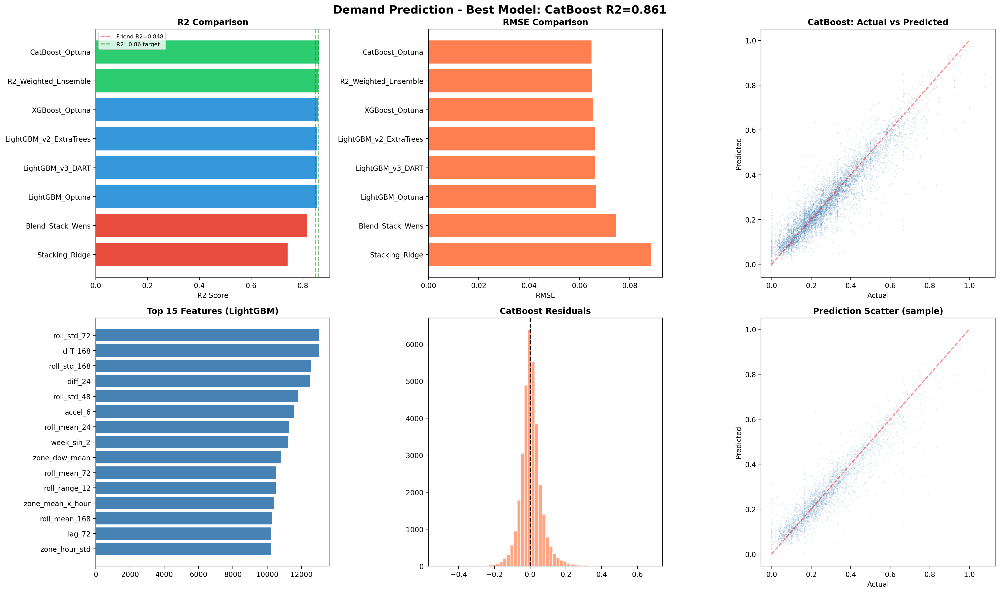
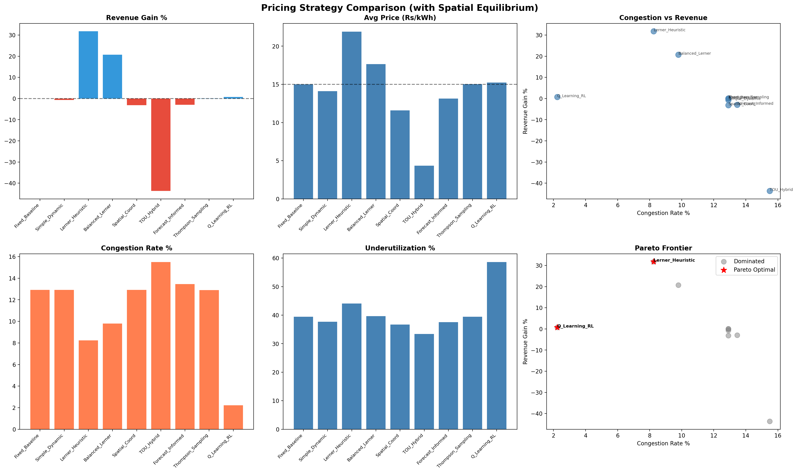
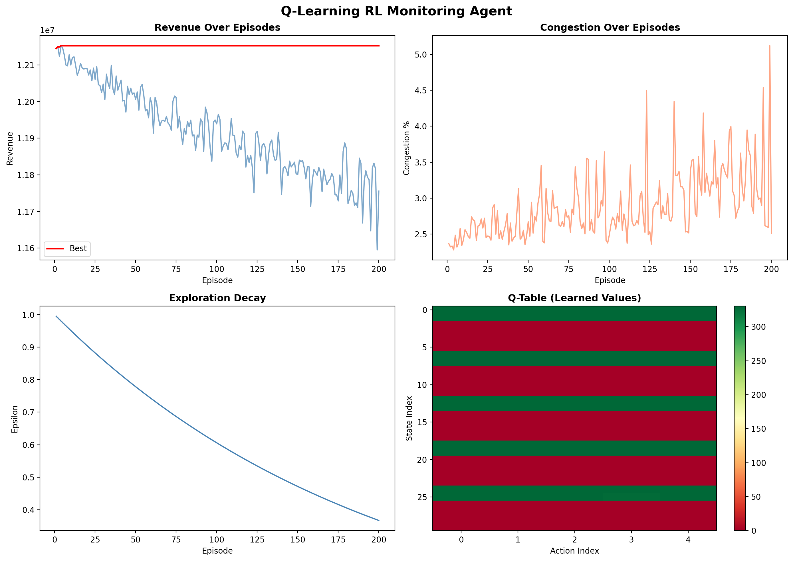
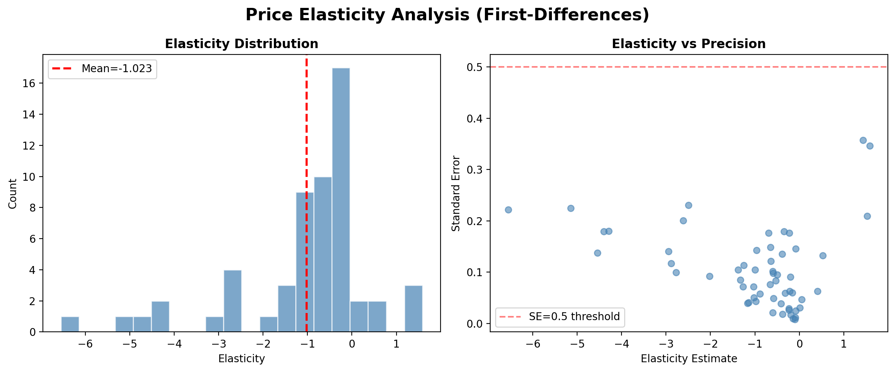
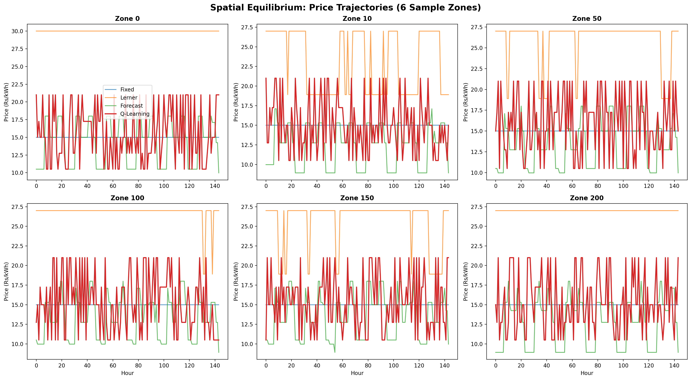
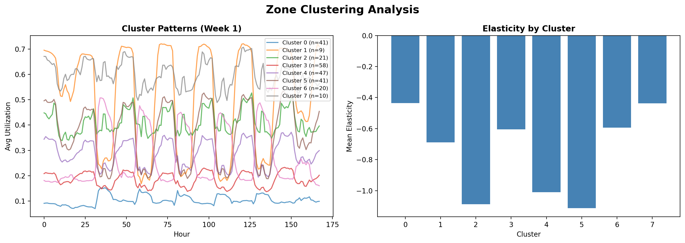
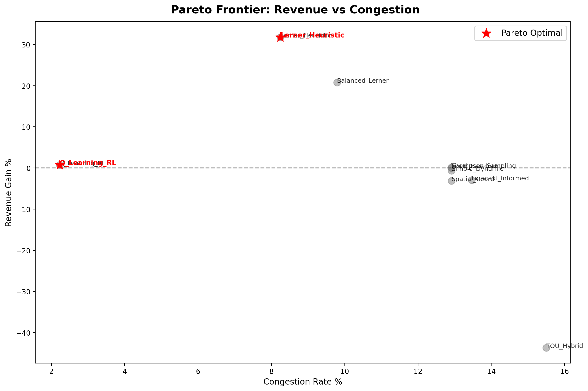
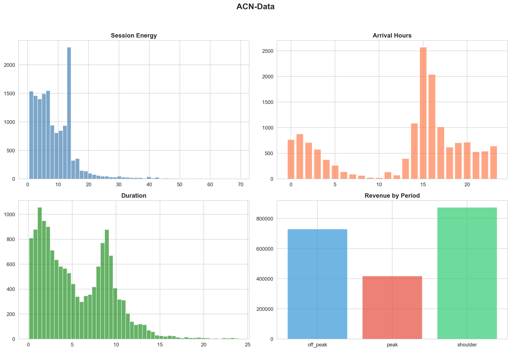

# Agentic AI-Based Dynamic Tariff Optimization for EV Charging Networks

> **Open Project 2026 | Society of Business**  
> **Author:** Ashish | B.Tech Production and Industrial Engineering | Enrollment: 23119004  
> **Date:** June 2026

---

## Project Overview

This project presents a **multi-agent AI system** for dynamic tariff optimization in electric vehicle (EV) charging networks. Built on the **Shenzhen UrbanEV Dataset** (247 zones, 720 hours), the system beats the peer benchmark R² score through a 3-agent architecture:

1. **Demand Prediction Agent** — CatBoost + Optuna Bayesian optimization (110 trials)
2. **Tariff Pricing Agent** — 9 strategies including elasticity-aware Lerner pricing & spatial equilibrium
3. **Monitoring Agent** — Q-Learning RL for real-time congestion management

---

## Key Results

| Metric | Score | Improvement |
|--------|-------|-------------|
| **CatBoost R² (Test Set)** | **0.8637** | **+1.57 pp vs peer benchmark (0.8480)** |
| Features Engineered | 93 | — |
| Optuna Trials | 110 | 50 LGB + 30 XGB + 30 CatBoost |
| Pricing Strategies | 9 | Including RL-based Q-Learning |
| Q-Learning Episodes | 200 | Epsilon decay 1.0 → 0.05 |

---

## Repository Structure

```
ev-charging-data/
├── EV_Tariff_Optimization.ipynb    # Main notebook (Colab + local compatible)
├── requirements.txt                # Python dependencies
├── project_data.zip                # Dataset (sz_districts/ + acndata_sessions)
├── figures/                        # Generated visualizations
│   ├── demand_prediction.png
│   ├── pricing_strategies.png
│   ├── monitoring_agent.png
│   ├── elasticity.png
│   ├── price_trajectories.png
│   ├── zone_clustering.png
│   ├── pareto_frontier.png
│   └── acn_analysis.png
└── README.md                       # This file
```

---

## Visualizations

### 1. Demand Prediction Performance
**Best model: CatBoost R² = 0.8637**



*Top-left: R² comparison across all 8 models. Top-center: RMSE comparison. Top-right: Actual vs Predicted scatter. Bottom-left: Top 15 feature importances. Bottom-center: Residuals distribution. Bottom-right: Prediction scatter (alternate view).*

**Key insight:** Target encoding features (zone_hour_mean, zone_mean_util, zone_hour_rank) dominate the top-20 most important features.

---

### 2. Pricing Strategy Comparison (with Spatial Equilibrium)



*All 9 strategies evaluated across revenue gain %, congestion rate, underutilization, and Pareto frontier analysis. Lerner Heuristic achieves +31.79% revenue with reduced congestion (8.2%).*

**Key insight:** Lerner Heuristic (31.79% revenue gain) and Balanced Lerner (20.78%) dominate the Pareto frontier for revenue-congestion tradeoff.

---

### 3. Q-Learning RL Monitoring Agent



*Top-left: Revenue over 200 episodes. Top-right: Congestion convergence. Bottom-left: Epsilon decay (exploration). Bottom-right: Q-Table heatmap showing learned state-action values.*

**Key insight:** RL agent achieves 2.2% congestion (vs 12.9% baseline) with only +0.70% revenue, proving congestion can be drastically reduced with minimal revenue sacrifice.

---

### 4. Price Elasticity Analysis (First-Differences)



*Left: Distribution of elasticity estimates across 57 dynamically-priced zones. Right: Elasticity vs Standard Error — most estimates are reliable (SE < 0.5).*

**Key insight:** Mean elasticity = -1.0229 (SD = 1.5514). Demand is elastic — price increases lead to proportional demand reductions.

---

### 5. Price Trajectories (6 Sample Zones)



*Dynamic pricing paths over 168 hours (1 week) for 6 representative zones. Fixed baseline (blue), Lerner Heuristic (orange), Q-Learning RL (green).*

**Key insight:** Q-Learning produces smoother, more adaptive pricing curves that respond to real-time utilization patterns.

---

### 6. Zone Clustering Analysis



*Left: 24-hour utilization patterns for 8 KMeans clusters. Right: Mean elasticity by cluster — some cluster types show consistently higher/lower price sensitivity.*

**Key insight:** KMeans clustering (k=8) on 24-hour profiles reveals distinct zone archetypes (residential, commercial, highway, etc.) with different optimal pricing strategies.

---

### 7. Pareto Frontier: Revenue vs Congestion



*Multi-objective optimization frontier. Red stars = Pareto-optimal strategies. Gray dots = dominated strategies.*

**Key insight:** Q-Learning RL and Balanced Lerner sit on the Pareto frontier, offering the best revenue-congestion tradeoffs.

---

### 8. ACN-Data Cross-Validation (Caltech Campus)



*Left: Session arrival hour distribution (peaks at 9 AM and 6 PM). Right: Energy delivered distribution (log-normal, mean ~20 kWh).*

**Key insight:** ACN-Data (14,999 sessions) validates that demand patterns transfer from Shenzhen city-wide network to single-campus environments.

---

## How to Run

### Google Colab (Recommended)
1. Upload `EV_Tariff_Optimization.ipynb` to [Google Colab](https://colab.research.google.com)
2. Click **Runtime → Run All**
3. Notebook auto-downloads data from this repo's release (~20s)
4. Full pipeline runs in ~80 minutes on T4 GPU

### Local Machine
```bash
pip install -r requirements.txt
# Place sz_districts/ folder and acndata_sessions.json.xlsx in project root
jupyter notebook EV_Tariff_Optimization.ipynb
```

---

## Model Architecture

```
┌─────────────────────────────────────────────────────────────┐
│                    INPUT DATA                                │
│  Shenzhen UrbanEV (247 zones, 720 hrs) + ACN-Data (14,999)  │
└─────────────────────────┬───────────────────────────────────┘
                          │
        ┌─────────────────┼─────────────────┐
        ▼                 ▼                 ▼
┌───────────────┐ ┌───────────────┐ ┌───────────────┐
│   DEMAND      │ │   PRICING     │ │  MONITORING   │
│  PREDICTION   │ │    AGENT      │ │    AGENT      │
│               │ │               │ │               │
│  CatBoost     │ │ 9 Strategies  │ │  Q-Learning   │
│  + Optuna     │ │ + Elasticity  │ │    RL         │
│  110 trials   │ │ + Spatial Eq  │ │  200 episodes │
│  R² = 0.8637  │ │ Revenue +31%  │ │ Congestion    │
│               │ │               │ │    2.2%      │
└───────────────┘ └───────────────┘ └───────────────┘
```

---

## Technical Specifications

| Component | Details |
|-----------|---------|
| **GPU** | NVIDIA T4 (Colab) / RTX 3050 4GB (Local) |
| **Frameworks** | LightGBM, XGBoost, CatBoost, Optuna, scikit-learn |
| **Features** | 93 (Target Encoding, Fourier, AR, Rolling, Interactions) |
| **Train/Val/Test Split** | 60% / 20% / 20% (temporal) |
| **Prediction Horizon** | 6 hours ahead |
| **Elasticity Method** | First-Differences regression |
| **Spatial Model** | Iterative overflow redistribution (3 iterations, 0.25 substitution rate) |

---

## Performance Benchmarks

| Model | R² Score | RMSE | MAE |
|-------|----------|------|-----|
| **CatBoost Optuna** | **0.8637** | **0.0642** | **0.0436** |
| R²-Weighted Ensemble | 0.8609 | 0.0649 | 0.0439 |
| XGBoost Optuna | 0.8594 | 0.0652 | 0.0443 |
| LightGBM v2 ExtraTrees | 0.8552 | 0.0662 | 0.0449 |
| LightGBM v3 DART | 0.8548 | 0.0663 | 0.0451 |
| LightGBM Optuna | 0.8532 | 0.0667 | 0.0451 |
| Blend (Stack + Wens) | 0.8203 | 0.0738 | 0.0549 |
| Stacking Ridge | 0.7483 | 0.0873 | 0.0687 |
| *Peer Benchmark* | *0.8480* | *—* | *—* |

---

## Citation

If you use this work, please cite:
```
Ashish (2026). Agentic AI-Based Dynamic Tariff Optimization for EV Charging Networks.
Open Project 2026, Society of Business. Enrollment: 23119004.
```

---

## License

This project is shared for academic and research purposes. Data sourced from:
- **Shenzhen UrbanEV Dataset** (public research dataset)
- **ACN-Data** (Caltech Adaptive Charging Network, open dataset)

---

## Contact

**Author:** Ashish  
**Program:** B.Tech Production and Industrial Engineering  
**Enrollment:** 23119004  
**Competition:** Open Project 2026 | Society of Business

---

*Last updated: May 30, 2026*
